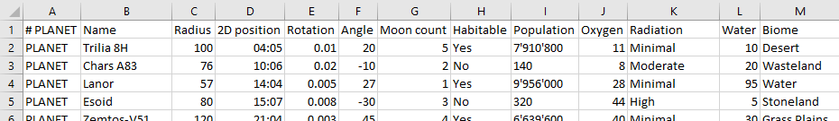
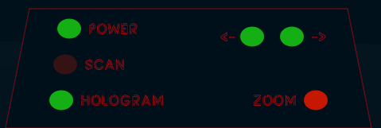
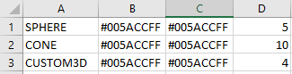

# Object-Oriented Programming Assignment - SciFi UI

Name: **Igor Bolek**

Student Number: **C17487376**

# Description of the assignment
We were asked to create a Sci-Fi interface with a variety of animations and effects that could be theorically used in a movie. Demonstration of Polymorphism, Abstraction, Inheritance and Interfaces was also required as well as exploration of Processing framework. I decided to explore 3D renderer adding additional layers of complexity and challenges that were not as easy to overcome compared to 2D renderer.

My idea was to create a spaceship dashboard that would display all nearby planets on semi-transparent screen where a planet can be selected for further inspection. There is also a second screen showing information of currently selected planet, and a hologram displaying that planet with its moons and orbit. I wanted to experiment with lighting, rotation and creation of custom shapes. Ultimately, this allowed me to create an effect impossible to achieve in 2D renderer.

# Instructions
## Video demonstrating functionality:
[](https://youtu.be/VB5xHbBoAfs)

All interaction is done in the controls console on the bottom of the screen.
1. System must first be turned on by toggling the *power* button..
2. Next, *scan* must be performed before planets can be shown
3. *Hologram* projection can be turned on/off after scan is complete.
4. Once Hologram projection is running, user can cycle through planets using *<-* and *->*  buttons. Information about them is displayed on the right screen.
5. Zooming is possible with either mouse wheel or clicking the Zoom button.


# How it works
All shapes (apart from 2 displays) are loaded from Shape.csv file (This includes the entire room, table, lights, hologram). All planets, and information about them are loaded from Stars.csv file. The files are read into the program using a custom file loader I created allowing different shapes to have different parameters. All lines starting with a hash (#), double quotes ("") are ignored allowing for comments within the file.
Using Processing's Table class to read the file would not allow for this. Creating my own file parser was a challenge because I had to deal with BOM (Byte Order Mark) which I discuss later in the Challenges section. 

Both shapes and planets are implementation of **UIElement** ***abstract*** class. 

```Java
abstract public class UIElement {
        public UI ui;
        public String type;

        public UIElement(UI ui, String type) {
                this.ui = ui;
                this.type = type;
        }

        abstract public void update();

        abstract public void render();
}
```

Shapes and planets are classified by the first comma separated value in each line, then be processed by a switch statement using appropriate constructor for each shape. For example a **CUSTOM3D** value will be processed  as follows:

```Java
case "CUSTOM3D":
        UIElement custom3d = new CustomShape(ui, lineSegments);
        elements.add(custom3d);
        System.out.println("Adding shape: " + lineSegments[0]);
        break;
```
This also shows an example of **polymorphism**.

The elements ArrayList is then returned to the main ArrayList in the UI.java class.

```Java
// Storing ALL Elements (Custom, spheres, radars etc..)
public ArrayList<UIElement> elements = new ArrayList<UIElement>();

public void setup(){
        // Load all shapes and planets from csv file
        elements = UIElementLoader.loadUI(this);
}
```

Planet object contains main planet, it's moons as well as their orbit.  There's also rotation angle, rotation speed and other information such as population, radiation, oxygen level etc.

 

Sphere shapes for planet, moons and orbits are of course children of UIElement, however, the Planet object is the only one that gets added to the main elements ArrayList. Planet get's rendered once in the main draw method but the Planet's internal render and update functions deal with rendering the entire planet, moons and orbits. Each moon has a random rotation speed around it's own axis, and the rotation around the main planet is achieved by going through each orbit vertex one by one. I tried rotation around the planet but the height would get shifted depending on the angle, making the rotation axis not the center of the main planet. Instead, I went for the orbit vertex path option. There is also a random light source generated for each planet. If the planet has more than 2 moons, then the vertex from the outermost orbit is chosen as position (with random height) for the light source to create illusion of sun shining on the surfaces of planets and moons.

There is a separate 2D GUI interaction console, that is rendered after the 3D scene. Using mouse we can control the planet viewer system by pressing the buttons on that console.



Originally I wanted to add 3D mouse interaction (mouse picking) to select planets, drag planet to rotate it and having the actual UI be part of the 3D space. However, that was too complex to acomplish. More in Challenges section.

# Challenges
I encountered many problems during this assignment. Here are the main problems I encountered and my solution to them:
- **Byte Order Mark**. An invisible Unicode character at the beginning of file (EF BB BF or FE FF/FF FE) that contains information for the program reading the file such as Excel, VS Code etc. When parsing the first line, the first comma separated value would also include BOM. For example: 



  "SPHERE" being the first value loaded into String and then printed out to console will output "SPHERE" as expected. However, if we wanted to print all entries that begin with "S", then it would get ignored. 
  After many hours of research, the solution was to check the file in HEX Editor to see how many bytes the BOM takes. In my case it was 3 bytes (EF BB BF). I made it so that my parser converts the string into a byte array, extract the first 3 bytes, copy the remainder into new, appropriately sized byte array and convert it back to string using ISO-8859-1 encoding:
  ```Java
 static private String checkBOM(String s) throws UnsupportedEncodingException {
        // Convert string to byte array
        byte[] lineBytes = s.getBytes();

        // Check if byte array contains Byte Order Mark
        if ((lineBytes[0] & 0xFF) == 0xEF && (lineBytes[1] & 0xFF) == 0xBB && (lineBytes[2] & 0xFF) == 0xBF) {
                // if yes, create new byte array, copy all bytes excluding first 3 and convert back to String using ISO-8859-1 encoding
                byte[] lineBytesNoBOM = new byte[lineBytes.length - 3];
                System.arraycopy(lineBytes, 3, lineBytesNoBOM, 0, lineBytesNoBOM.length);
                String temp = new String(lineBytesNoBOM, "ISO-8859-1"); // 8-bit ASCII
                return temp;
        } else {
                return s;
        }
}
  ```

- **Mouse Picking**. Originally I wanted to create a 3D interaction using ray casting to select planets, rotate them, etc. I ended up wasting days trying to figure out how to implement it and even downloaded specific libraries from the Lightweight Java Game Library (LWJGL) that deal with matrix translations, inversions and other calculations. I followed a tutorial that showed the implementation in another engine, however, I did not fully understand those calculations and ended up deleting all related code and libraries. Instead I decided to create a little 2D console that would contain all the interaction buttons to control the system. 

# What I am most proud of in the assignment
I am most proud of the fact that I was able to overcome almost all challenges which made me learn fundamentals of 3D renderers. I am now more interested to create my own project utilising popular 3D engines such as making a mobile game with Unity/Unreal, while still developing my 2D tile-based game in C++ using SDL libraries. I might switch to [Heaps](https://heaps.io/) engine based on [Haxe](https://haxe.org/) language. It would allow me to use both 2D and 3D with more ease than writing everything in C++ from scratch.

Overall, I had great fun creating this project. Unfortunately, we had 2 more assignments from other modules going on at the same time so I couldn't spend more time with researching and understanding Mouse Picking techniques and learning matrix calculations as well as adding more content and interaction.
